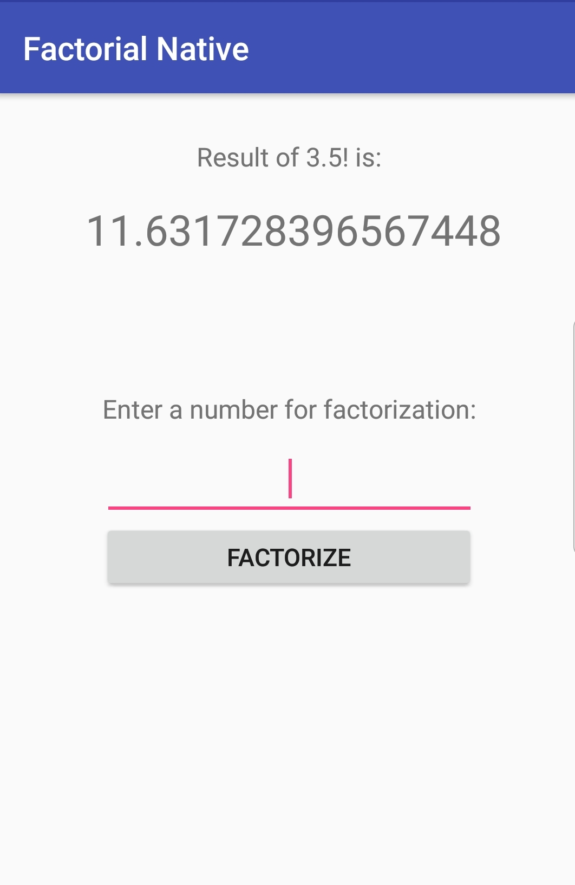

# Factorial Native

Implementation of a trivial Factorization algorithm for Android using **Native Interface**.

The application makes use of the *'gamma'* function provided by C. This allows the computation of non-integers such as doubles, provided they are positive.

This sample uses the new [Android Studio CMake plugin](http://tools.android.com/tech-docs/external-c-builds) with C/C++ support.

Screenshots
-----------

